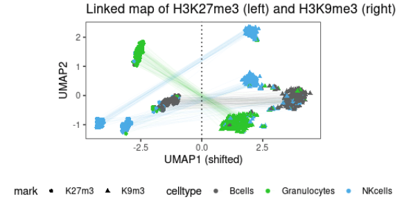

# scChIX
Repository for scChIX

This is the R package for deconvolving multiplexed histone modifications ([https://www.biorxiv.org/content/10.1101/2021.04.26.440629v1](https://www.biorxiv.org/content/10.1101/2021.04.26.440629v1)). 

```
library(devtools)
devtools::install_github("jakeyeung/scChIX")
```

Follow the vignettes for an example of deconvolving the multiplexed signal. The output is a linked UMAP. In the example it is H3K27me3 UMAP on the left, H3K9me3 UMAP on the right, with lines connecting the two maps together:




## Vignettes for guided analysis of downstream analysis

Here are a list of vignettes for guided analysis:

[Simulation studies and downstream analysis of estimates versus ground truth:](https://github.com/jakeyeung/scChIX/blob/main/vignettes/scChIX-simulation.md)

[Analysis of scChIX downstream:](https://github.com/jakeyeung/scChIX/blob/main/vignettes/scChIX-vignette.md)

