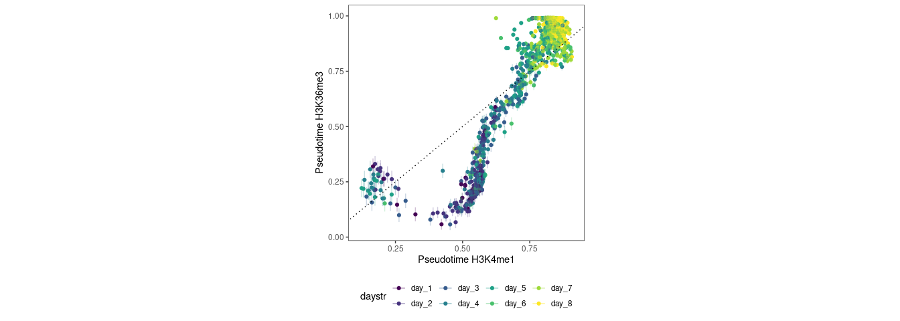

-   [Load training data and double-incubated count
    matrix](#load-training-data-and-double-incubated-count-matrix)
-   [scChIX in continuous domain: jointly inferring two pseudotimes
    using double-incubated
    cells](#scchix-in-continuous-domain-jointly-inferring-two-pseudotimes-using-double-incubated-cells)
-   [scChIX downstream: plot relationship between H3K4me1 and
    H3K36me3](#scchix-downstream-plot-relationship-between-h3k4me1-and-h3k36me3)

## Load training data and double-incubated count matrix

In this notebook, we will infer relationships between two correlated
histone marks, H3K4me1 and H3K36me3, from double-incubated cells.

First, we load our training data.

``` r
# These objects are too large for github, so download them from seafile.ist.ac.at:

# wget https://seafile.ist.ac.at/f/4c9902f7e77e4e78b02e/?dl=1 -O LowessFits_H3K4me1.RData
# wget https://seafile.ist.ac.at/f/c1bdec80ab8943d790f3/?dl=1 -O LowessFits_H3K36me3.RData


# load(LowessFits_H3K4me1, v=T)
# Loading objects:
#   lowess.fits.k4me1
# load(LowessFits_H3K36me3, v=T)
# Loading objects:
#   lowess.fits.k36me3
```

Next we load our count matrix.

``` r
data(MacDiffDblMat_H3K4me1xH3K36me3)
# Loading objects:
#   mat.dbl.knn25
```

## scChIX in continuous domain: jointly inferring two pseudotimes using double-incubated cells

Our training data takes a pseudotime value (number between 0 and 1) and
outputs the predicted gene expression for every gene. We can therefore
use this training data to infer the pseudotime of H3K4me1 ahd H3K36me3
for each double-incubated cell.

To speed things up, we will run scChIX on just a subset of cells.

``` r
set.seed(0)
ncores <- 16

subset.fraction <- 1
w <- 0.77

jcells <- colnames(mat.dbl); names(jcells) <- jcells
print(length(jcells))
#> [1] 1271
jcells.subset <- sample(jcells, size = floor(subset.fraction * length(jcells)), replace = FALSE)
print(length(jcells.subset))
#> [1] 1271
print("Running fits...")
#> [1] "Running fits..."

# system.time(
#   dat.fits.raw <- parallel::mclapply(jcells.subset, function(jcell){
#     cell.count.raw.merged <- mat.dbl[, jcell]
#     jfit.fixedw <- FitMixingWeightPtimeLinear.fixedw(cell.count.raw.merged = cell.count.raw.merged, jfits.lowess1 = lowess.fits.k4me1, jfits.lowess2 = lowess.fits.k36me3, w.fixed = w, p1.init = 0.5, p1.lower = 0.01, p1.upper = 0.99,  p2.init = 0.5, p2.lower = 0.01, p2.upper = 0.99, jmethod = "L-BFGS-B", jhessian = TRUE)
#   }, mc.cores = ncores)
# )
# print("Running fits... done")

# or you can just load the fit outputs
data(scChIXOutputs_H3K4me1xH3K36me3) # dat.fits.raw
```

## scChIX downstream: plot relationship between H3K4me1 and H3K36me3

We extract the inferred pseudotime and its standard errors from each
cell.

``` r
dat.fits.clean.lst <- lapply(jcells.subset, function(jcell){
  jdat <- data.frame(cell = jcell,
                     ptime1 = dat.fits.raw[[jcell]]$par[[1]],
                     ptime2 = dat.fits.raw[[jcell]]$par[[2]],
                     stringsAsFactors = FALSE)
  # get se
  mathessian <- dat.fits.raw[[jcell]]$hessian
  inversemathessian <- solve(mathessian)
  res <- sqrt(diag(inversemathessian))
  jdat$ptime1.se <- res[[1]]
  jdat$ptime2.se <- res[[2]]
  return(jdat)
})


dat.fits.clean <- dat.fits.clean.lst %>%
  bind_rows() %>%
  rowwise() %>%
  mutate(daystr = paste0("day_", scChIX::GetDayFromCellByRow(cell)))
```

We plot the outputs to verify that the double-incubated cells show a
pseudotime progression from 0 to 1. We can color each double-incubated
cell by the day from which they were calculated during the 7-day time
course to verify that later pseudotimes correspond to later days in the
time course.

For each cell, we plot the maximum likelihood pair of pseudotimes for
H3K4me1 (x-axis) and H3K36me3 (y-axis) as well as the 99% confidence
intervals.

``` r
jfactor <- 2.6
m <- ggplot(dat.fits.clean, aes(x = ptime1, y = ptime2,
                                xmin = ptime1 - ptime1.se * jfactor,
                                xmax = ptime1 + ptime1.se * jfactor,
                                ymin = ptime2 - ptime2.se * jfactor,
                                ymax = ptime2 + ptime2.se * jfactor,
                                color = daystr)) +
  geom_point(alpha = 1) +
  geom_errorbar(alpha = 0.25) +
  geom_errorbarh(alpha = 0.25) +
  theme_bw() +
  scale_color_viridis_d() +
  geom_abline(slope = 1, linetype = "dotted") +
  xlab("Pseudotime H3K4me1") +
  ylab("Pseudotime H3K36me3") +
  theme(aspect.ratio=1, panel.grid.major = element_blank(), panel.grid.minor = element_blank(), legend.position = "bottom")
print(m)
```


