``` r
library(scChIX)
library(dplyr)
library(ggplot2)
library(data.table)
library(umap)
library(hash)
library(igraph)
# library(devtools)
# install_github("bowang-lab/simATAC")
library(simATAC)
library(JFuncs) # for plotting multiple panels in one plot
library(irlba)
```

Simulating scChIX input data
----------------------------

First we set up some parameters to simulate scChIX data. We will set
half the bins to be “mutually exclusive” while the other half will be
overlapping.

``` r
hubprefix <- getwd()
outdir <- file.path(hubprefix, "snakemake_inputs_countmats")
dir.create(outdir, recursive = TRUE)

jspec <- "hg38"
jseed <- 0
jncells.per.rep <- 250
jnbins <- 10000
jlibmean <- 12
jlibsd <- 1
jlibp <- 0.5
jzp <- 1
shuffle.rows.seed <- jseed

sim.params <- list(jspec = jspec,
                   jseed = jseed,
                   jncells.per.rep = jncells.per.rep,
                   jnbins = jnbins,
                   jlibmean = jlibmean,
                   jlibsd = jlibsd,
                   jlibp = jlibp,
                   jzp = jzp)


# Run simulation ----------------------------------------------------------

ctypes <- c("A", "B", "C")
names(ctypes) <- ctypes

ctype.params <- list(ctype.name = c("A", "B", "C"),
                     jseed = c(0, 123, 999),
                     shuffle.rows.seed = c(0, 123, 999),
                     frac.mutual.excl = c(0.5, 0.5, 0.5))

ctype.params.lst <- lapply(ctypes, function(ctype){
  i <- which(ctype.params$ctype.name == ctype)
  return(list(ctype = ctype,
              jseed = ctype.params$jseed[[i]],
              shuffle.rows.seed = ctype.params$shuffle.rows.seed[[i]],
              frac.mutual.excl = ctype.params$frac.mutual.excl[[i]]))
})
```

For each of the three cell types, we generate three count matrices.
First represents histone mark 1, second represents histone mark 2, and
the third represents histone mark 1+2 double-incubation.

``` r

ctype.sim.counts.lst <- lapply(ctypes, function(jctype){
  scChIX::SimulateChICseq(ctype.name = jctype,
                  jseed = ctype.params.lst[[jctype]]$jseed,
                  shuffle.rows.seed = ctype.params.lst[[jctype]]$shuffle.rows.seed,
                  frac.mutual.excl = ctype.params.lst[[jctype]]$frac.mutual.excl)
})
#> simATAC is:
#> ...updating parameters...
#> ...setting default parameters...
#> ...setting up SingleCellExperiment object...
#> Your data has different number of bins compared to the provided genome positions. Please give a file of bin information consistent with your input data with three columns and header of "chr start end" as the bin.coordinate.file parameter. If you don't give a file containing the information of bins, simATAC considers the bin.coordinate.file parameter as "None" and names the bins {Bin1 to BinX} with X number of bins. In this case, you wont be able to get the coordinate information of bins. Please make sure the "species" parameter of the simATACCount object is set correctly.
#> ...simulating library size...
#> ...simulating non-zero cell proportion...
#> ...simulating bin mean...
#> ...generating final counts...
#> ...Done...
#> [1] 0.4140963
#>             Bin  BinMean Bin.Orig
#> Bin127  Bin4499 4.069776   Bin127
#> Bin126  Bin4782 3.867244   Bin126
#> Bin781  Bin4023 2.236004   Bin781
#> Bin2382 Bin1391 2.112053  Bin2382
#> Bin4674 Bin1918 1.952029  Bin4674
#> Bin1983 Bin1116 1.804295  Bin1983
#> Formal class 'dgCMatrix' [package "Matrix"] with 6 slots
#>   ..@ i       : int [1:1552861] 27 36 38 43 53 60 63 76 83 97 ...
#>   ..@ p       : int [1:751] 0 2459 5705 6915 8289 9792 11767 13086 14551 15927 ...
#>   ..@ Dim     : int [1:2] 5000 750
#>   ..@ Dimnames:List of 2
#>   .. ..$ : chr [1:5000] "Bin1" "Bin2" "Bin3" "Bin4" ...
#>   .. ..$ : chr [1:750] "Cell1" "Cell2" "Cell3" "Cell4" ...
#>   ..@ x       : num [1:1552861] 1 3 1 1 3 1 1 1 1 1 ...
#>   ..@ factors : list()
#> NULL
#> 5 x 5 sparse Matrix of class "dgCMatrix"
#>         Cell1_A Cell2_A Cell3_A Cell4_A Cell5_A
#> Bin1422       .       .       .       .       .
#> Bin1017       .       .       .       .       .
#> Bin4775       .       1       .       .       .
#> Bin2177       .       .       .       .       .
#> Bin1533       .       .       .       .       .
#> simATAC is:
#> ...updating parameters...
#> ...setting default parameters...
#> ...setting up SingleCellExperiment object...
#> Your data has different number of bins compared to the provided genome positions. Please give a file of bin information consistent with your input data with three columns and header of "chr start end" as the bin.coordinate.file parameter. If you don't give a file containing the information of bins, simATAC considers the bin.coordinate.file parameter as "None" and names the bins {Bin1 to BinX} with X number of bins. In this case, you wont be able to get the coordinate information of bins. Please make sure the "species" parameter of the simATACCount object is set correctly.
#> ...simulating library size...
#> ...simulating non-zero cell proportion...
#> ...simulating bin mean...
#> ...generating final counts...
#> ...Done...
```

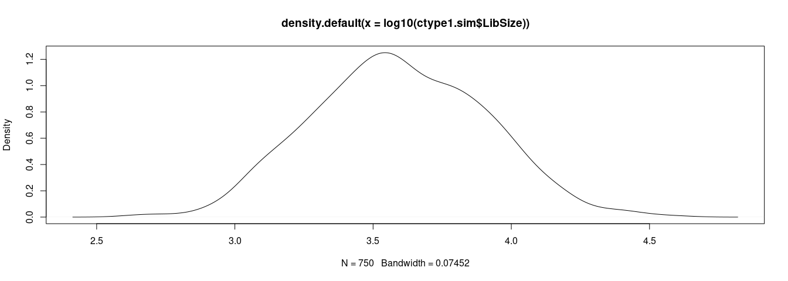

    #> [1] 0.4261821
    #>             Bin  BinMean Bin.Orig
    #> Bin127   Bin195 4.069776   Bin127
    #> Bin126  Bin3092 3.867244   Bin126
    #> Bin2382 Bin1210 2.208168  Bin2382
    #> Bin781  Bin3399 2.091723   Bin781
    #> Bin4674 Bin3662 1.816923  Bin4674
    #> Bin2362 Bin3444 1.810604  Bin2362
    #> Formal class 'dgCMatrix' [package "Matrix"] with 6 slots
    #>   ..@ i       : int [1:1598183] 0 10 23 26 36 56 122 125 126 149 ...
    #>   ..@ p       : int [1:751] 0 1575 2846 5039 7016 7830 9893 12104 14257 15534 ...
    #>   ..@ Dim     : int [1:2] 5000 750
    #>   ..@ Dimnames:List of 2
    #>   .. ..$ : chr [1:5000] "Bin1" "Bin2" "Bin3" "Bin4" ...
    #>   .. ..$ : chr [1:750] "Cell1" "Cell2" "Cell3" "Cell4" ...
    #>   ..@ x       : num [1:1598183] 1 1 1 1 1 1 1 22 15 1 ...
    #>   ..@ factors : list()
    #> NULL
    #> 5 x 5 sparse Matrix of class "dgCMatrix"
    #>         Cell1_B Cell2_B Cell3_B Cell4_B Cell5_B
    #> Bin2463       1       .       .       .       .
    #> Bin2511       .       .       .       .       .
    #> Bin2227       .       .       .       .       .
    #> Bin526        .       .       .       .       .
    #> Bin4291       .       1       .       .       .
    #> simATAC is:
    #> ...updating parameters...
    #> ...setting default parameters...
    #> ...setting up SingleCellExperiment object...
    #> Your data has different number of bins compared to the provided genome positions. Please give a file of bin information consistent with your input data with three columns and header of "chr start end" as the bin.coordinate.file parameter. If you don't give a file containing the information of bins, simATAC considers the bin.coordinate.file parameter as "None" and names the bins {Bin1 to BinX} with X number of bins. In this case, you wont be able to get the coordinate information of bins. Please make sure the "species" parameter of the simATACCount object is set correctly.
    #> ...simulating library size...
    #> ...simulating non-zero cell proportion...
    #> ...simulating bin mean...
    #> ...generating final counts...
    #> ...Done...

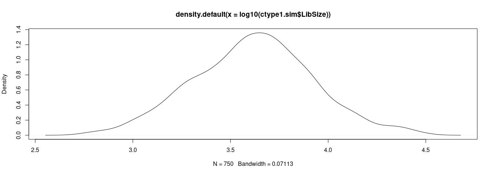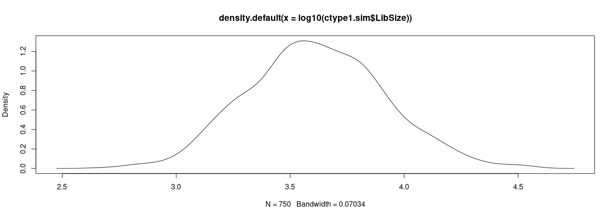

    #> [1] 0.4240136
    #>             Bin  BinMean Bin.Orig
    #> Bin127  Bin2559 4.069776   Bin127
    #> Bin126  Bin4901 3.794844   Bin126
    #> Bin2382 Bin2098 2.236004  Bin2382
    #> Bin4674 Bin3961 1.893565  Bin4674
    #> Bin3303 Bin4328 1.887121  Bin3303
    #> Bin781  Bin2801 1.855056   Bin781
    #> Formal class 'dgCMatrix' [package "Matrix"] with 6 slots
    #>   ..@ i       : int [1:1590051] 9 11 19 23 36 49 83 102 117 120 ...
    #>   ..@ p       : int [1:751] 0 2670 3640 5598 8178 11791 14587 16569 19987 22007 ...
    #>   ..@ Dim     : int [1:2] 5000 750
    #>   ..@ Dimnames:List of 2
    #>   .. ..$ : chr [1:5000] "Bin1" "Bin2" "Bin3" "Bin4" ...
    #>   .. ..$ : chr [1:750] "Cell1" "Cell2" "Cell3" "Cell4" ...
    #>   ..@ x       : num [1:1590051] 1 1 1 2 2 1 1 1 1 1 ...
    #>   ..@ factors : list()
    #> NULL
    #> 5 x 5 sparse Matrix of class "dgCMatrix"
    #>         Cell1_C Cell2_C Cell3_C Cell4_C Cell5_C
    #> Bin923        .       .       .       .       1
    #> Bin2409       .       .       .       .       .
    #> Bin1034       .       .       .       .       .
    #> Bin2339       .       .       1       .       .
    #> Bin3351       .       .       .       .       .


    # Create simulated matrix -------------------------------------------------


    jmark1 <- "mark1"
    jmark2 <- "mark2"
    jmarkdbl <- paste(jmark1, jmark2, sep = "-")

    mat.mark1 <- scChIX::ConcatMat(ctype.sim.counts.lst, ctypes, jmark = "mark1")
    mat.mark2 <- scChIX::ConcatMat(ctype.sim.counts.lst, ctypes, jmark = "mark2")
    mat.markdbl <- scChIX::ConcatMat(ctype.sim.counts.lst, ctypes, jmark = "markdbl")

    mat.mark.lst <- list(mat.mark1, mat.mark2, mat.markdbl)
    names(mat.mark.lst) <- c(jmark1, jmark2, jmarkdbl)

    jmarks <- names(mat.mark.lst)
    names(jmarks) <- jmarks

We do a quick check the UMAPs of these count matrices that they are
three different cell types for each histone mark.

``` r

jsettings <- umap.defaults
jsettings$n_neighbors <- 150
jsettings$min_dist <- 0.1
jsettings$random_state <- 123
cbPalette <- c("#696969", "#56B4E9", "#F0E442", "#0072B2", "#D55E00", "#CC79A7", "#006400",  "#32CD32", "#FFB6C1", "#0b1b7f", "#ff9f7d", "#eb9d01", "#2c2349", "#753187", "#f80597")

dat.umap.init.lst <- lapply(mat.mark.lst, function(jmat){
  print(head(jmat[1:5, 1:5]))
  lsi.out <- scchicFuncs::RunLSI(as.matrix(jmat)) # requires irlba
  dat.umap.mark <- scchicFuncs::DoUmapAndLouvain(topics.mat = lsi.out$u, jsettings = jsettings)
  return(dat.umap.mark)
})
#> 5 x 5 sparse Matrix of class "dgCMatrix"
#>      Cell1_A Cell2_A Cell3_A Cell4_A Cell5_A
#> Bin1       .       .       .       .       .
#> Bin2       3       5       .       1       1
#> Bin3       1       .       1       .       .
#> Bin4       1       1       .       .       .
#> Bin5       5      10       2       .       3
#> 5 x 5 sparse Matrix of class "dgCMatrix"
#>      Cell251_A Cell252_A Cell253_A Cell254_A Cell255_A
#> Bin1         2         .         3         .         2
#> Bin2         .         .         .         .         1
#> Bin3         .         1         1         .         .
#> Bin4         .         .         1         .         .
#> Bin5         .         .         .         .         .
#> 5 x 5 sparse Matrix of class "dgCMatrix"
#>      Cell501_AxCell501_A Cell502_AxCell502_A Cell503_AxCell503_A
#> Bin1                   2                   6                   .
#> Bin2                   .                   6                   1
#> Bin3                   .                   .                   .
#> Bin4                   .                   .                   .
#> Bin5                   3                   3                   2
#>      Cell504_AxCell504_A Cell505_AxCell505_A
#> Bin1                   3                   3
#> Bin2                   .                   1
#> Bin3                   .                   .
#> Bin4                   .                   .
#> Bin5                   1                   4

jmarks <- names(dat.umap.init.lst); names(jmarks) <- jmarks
m.lst <- lapply(jmarks, function(jmark){
  jdat <- dat.umap.init.lst[[jmark]]
  m <- ggplot(jdat, aes(x = umap1, y = umap2, color = louvain)) +
    geom_point() +
    theme_bw() +
    ggtitle(jmark) + 
    scale_color_manual(values = cbPalette) +
    theme(aspect.ratio=1, panel.grid.major = element_blank(), panel.grid.minor = element_blank())
  return(m)
})

print(m.lst)
#> $mark1
```

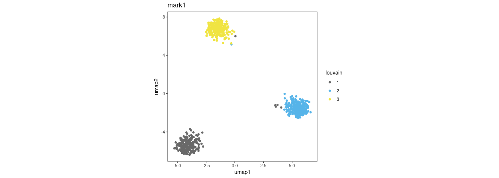

    #> 
    #> $mark2

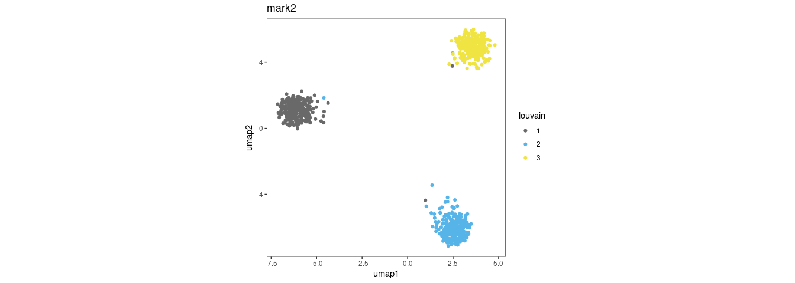

    #> 
    #> $`mark1-mark2`

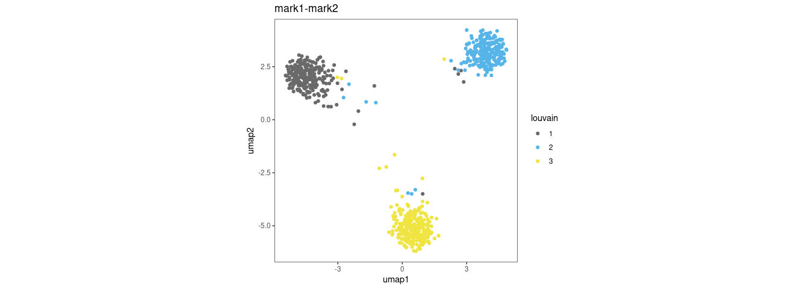

Running scChIX on input data
----------------------------

Write the count matrices to a directory (see
`inst/extdata/countmat_var_filt.mark1.rds` for example) and then run the
snakemake workflow `snakemake_workflow/run_snakemake.simulation_data.sh`
changing the paths to the correct directories.

The snakemake workflow takes several hours to complete, so we will just
load and analyze the results in this notebook.

Downstream analysis of scChIX to check simulated data
-----------------------------------------------------

Load the scChIX outputs for the simulated data for three overlapping
scenarios: `frac.mutual.excl=0.01, 0.5, 0.99`

``` r
data(Simulation_scChIX_Outputs, verbose=FALSE)
```

We can plot the empirical 95% confidence intervals from our estimates of
the degree of overlaps.

``` r

# we use the scenario of 0.99 mutually exclusive bins because that spans 
# the range of degree of overlaps from 0 to 1.
dat.binmeans.binned <- dat.binmeans.lst.lst$`0.99` %>%
  bind_rows() %>%
  rowwise() %>%
  mutate(xbin = round(BinMean.dbl, 2)) %>%
  group_by(xbin) %>%
  summarise(Mean = mean(overlap.estimate),
            StdDev = sd(overlap.estimate),
            CI.lower = quantile(overlap.estimate, 0.05),
            CI.upper = quantile(overlap.estimate, 0.95),
            CI.lower.centered = CI.lower - Mean,
            CI.upper.centered = CI.upper - Mean)

ggplot(dat.binmeans.binned, aes(x = xbin, y = StdDev)) +
  geom_point() +
  theme_bw() +
  theme(aspect.ratio=1, panel.grid.major = element_blank(), panel.grid.minor = element_blank()) +
  xlab("Fraction of Bin Signal Multiplexed to Mark 1") +
  ylab("Standard Deviation")
```

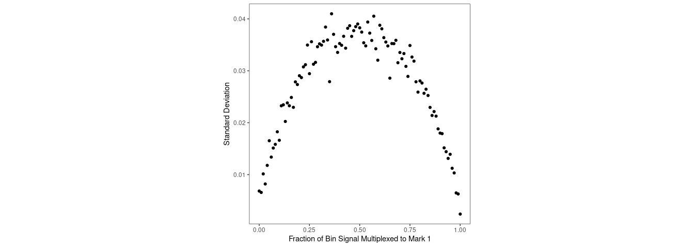

``` r
ggplot(dat.binmeans.binned, aes(x = xbin, y = Mean, ymin = CI.lower, ymax = CI.upper)) +
  geom_abline(slope = 1, color = 'blue', size = 1, alpha = 0.5) +
  geom_point() +
  geom_errorbar() +
  theme_bw() +
  theme(aspect.ratio=1, panel.grid.major = element_blank(), panel.grid.minor = element_blank()) +
  xlab("True Fraction of Bin Signal Multiplexed to Mark 1") +
  ylab("Inferred Fraction of Bin Signal Multiplexed to Mark 1\n(ErrorBars: 95% CI)")
```

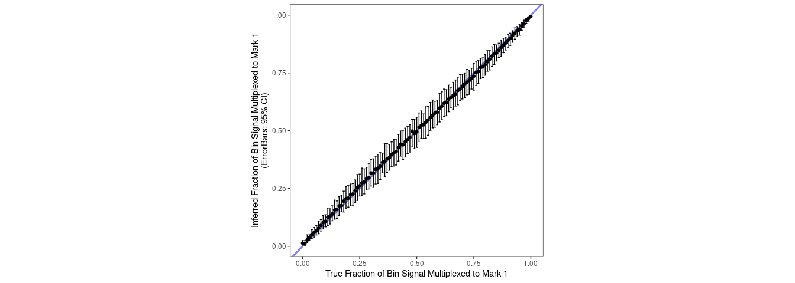

``` r
ggplot(dat.binmeans.binned, aes(x = xbin, y = 0, ymin = CI.lower.centered, ymax = CI.upper.centered)) +
  geom_point() +
  geom_errorbar() +
  theme_bw() +
  theme(aspect.ratio=1, panel.grid.major = element_blank(), panel.grid.minor = element_blank()) +
  xlab("True Fraction of Bin Signal Multiplexed to Mark 1") +
  ylab("95% Confidence Interval (+/- Fraction)") +
  coord_cartesian(ylim = c(-0.1, 0.1))
```

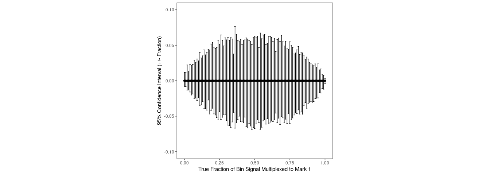

``` r
ggplot(dat.binmeans.binned, aes(x = xbin, y = 0, ymin = CI.lower.centered, ymax = CI.upper.centered)) +
  geom_point() +
  geom_errorbar() +
  theme_bw() +
  theme(aspect.ratio=0.33, panel.grid.major = element_blank(), panel.grid.minor = element_blank()) +
  xlab("True Fraction of Bin Signal Multiplexed to Mark 1") +
  ylab("95% Confidence Interval (+/- Fraction)") +
  coord_cartesian(ylim = c(-0.1, 0.1))
```

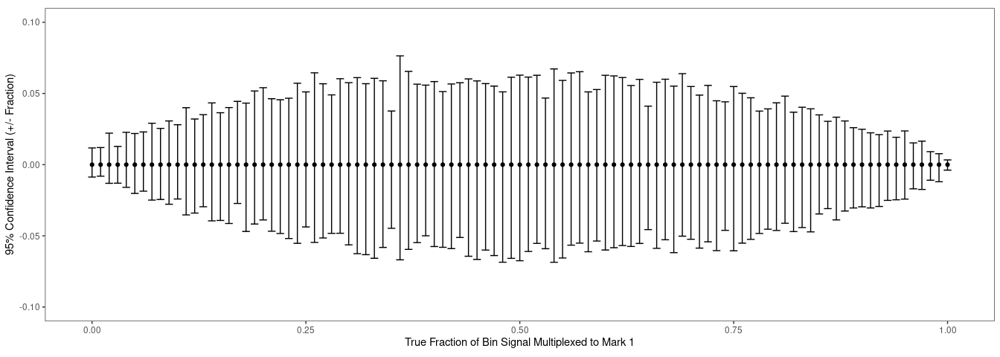

We can show that the two UMAPs can be linked together using the
deconvolved double-incubated cells as anchors.

``` r
# Plot umaps  -------------------------------------------------------------

dat.umap.long <- dat.umap.lst %>% bind_rows() %>%
  rowwise() %>%
  mutate(umap2.scale = ifelse(ctype == "B", umap2.scale + 0.75, umap2.scale)) # shift up to improve visualization

cbPalette.ctype <- c("#FFB6C1", "#32CD32", "#56B4E9", "#FFB6C1", "#F0E442", "#0072B2", "#D55E00", "#CC79A7", "#006400", "#FFB6C1", "#32CD32", "#0b1b7f", "#ff9f7d", "#eb9d01", "#7fbedf")
ggplot(dat.umap.long, aes(x = umap1.scale.shift, y = umap2.scale, color = ctype, group = cell)) +
  geom_point() +
  geom_path(alpha = 0.02) +
  geom_vline(xintercept = 0, linetype = "dotted") +
  scale_color_manual(values = cbPalette.ctype, na.value = "grey85") +
  facet_wrap(~frac.overlapping.bins) +
  theme_bw() +
  theme(aspect.ratio=0.5, panel.grid.major = element_blank(), panel.grid.minor = element_blank(), legend.position = "bottom")
```

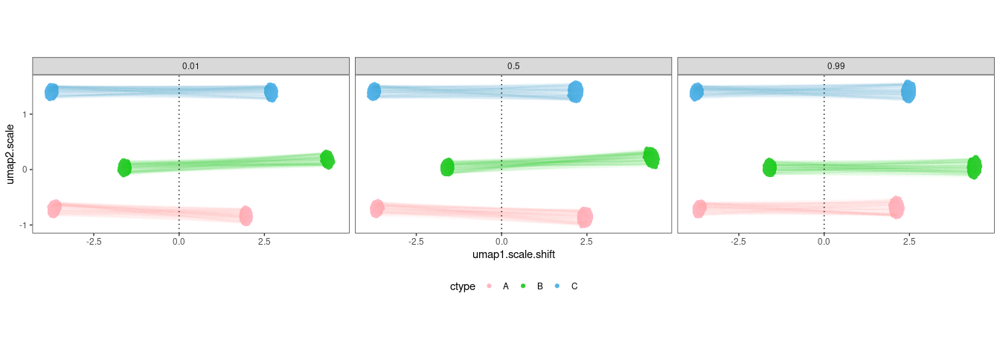

Finally we can plot the distribution of overlap estimates across the
bins and compare how these distributions look compared to ground truth.

``` r
frac.mutexcl.str.vec <- c("0.01", "0.5", "0.99"); names(frac.mutexcl.str.vec) <- frac.mutexcl.str.vec

dat.binmeans.lst <- lapply(frac.mutexcl.str.vec, function(jfrac){
  dat.binmeans.lst.lst[[jfrac]] %>%
    bind_rows()
})

m.lst <- lapply(frac.mutexcl.str.vec, function(jfrac){
  jtitle <- jfrac # mutually exclusive
  jtitle <- 1 - as.numeric(jtitle) # degree of overlap
  m <- ggplot(dat.binmeans.lst[[jfrac]], aes(x = BinMean.dbl, fill = annot, y = ..count../sum(..count..))) +
    geom_histogram(bins = 50, position = "identity", alpha = 0.5) +
    ggtitle(paste("True Fraction of Signal Multiplexed to Mark 1. Frac overlap: ", jtitle)) +
    theme_bw() +
    theme(aspect.ratio=1, panel.grid.major = element_blank(), panel.grid.minor = element_blank(), legend.position = "bottom")
  return(m)
})

print(m.lst)
#> $`0.01`
```

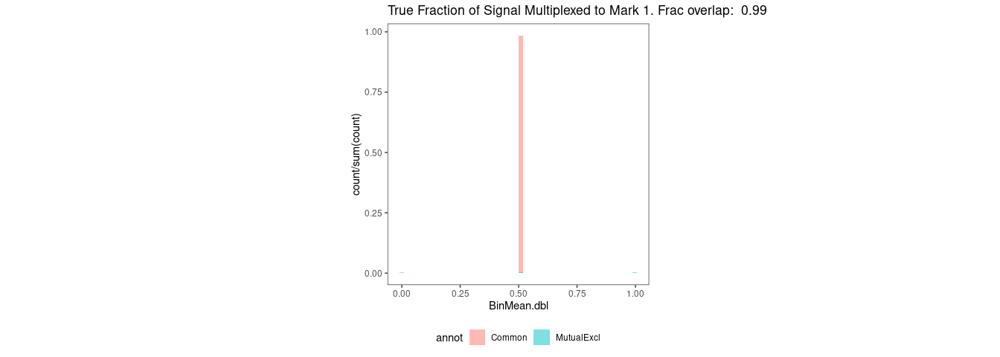

    #> 
    #> $`0.5`

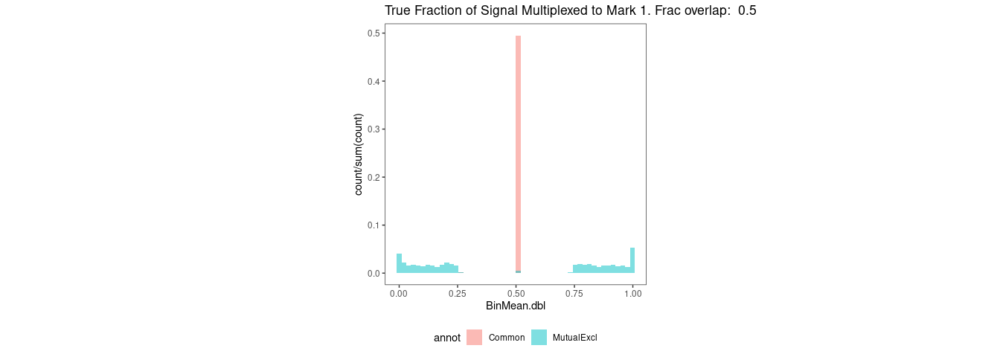

    #> 
    #> $`0.99`

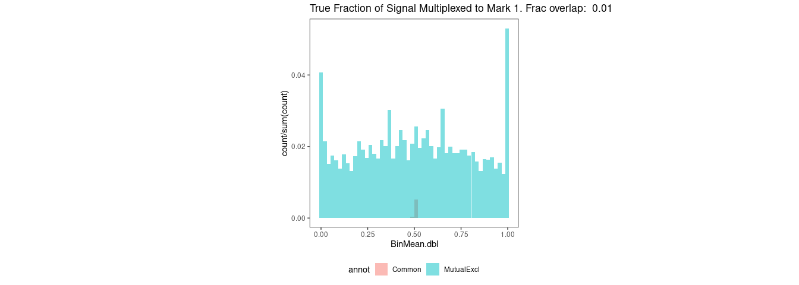

``` r
JFuncs::multiplot(m.lst[[1]], m.lst[[2]], m.lst[[3]], cols = 3)
```

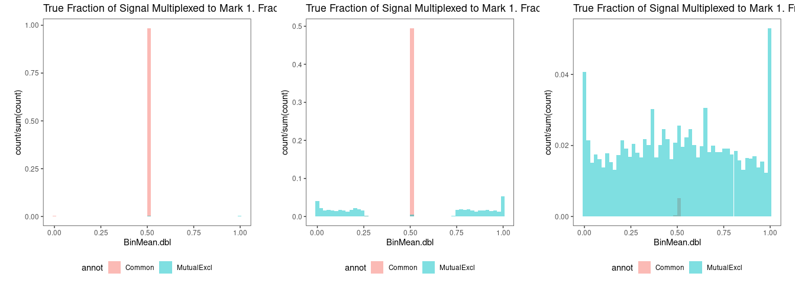

``` r

m.infer.lst <- lapply(frac.mutexcl.str.vec, function(jfrac){
  jtitle <- ifelse(jfrac == "1.0", "0.99", jfrac)
  jtitle <- 1 - as.numeric(jtitle)
  m <- ggplot(dat.binmeans.lst[[jfrac]], aes(x = overlap.estimate, fill = annot, y = ..count../sum(..count..))) +
    geom_histogram(bins = 50, position = "identity", alpha = 0.5) +
    ggtitle(paste("Inferred Fraction of Signal Multiplexed to Mark 1. Frac overlap: ", jtitle)) +
    theme_bw() +
    theme(aspect.ratio=1, panel.grid.major = element_blank(), panel.grid.minor = element_blank(), legend.position = "bottom")
  return(m)
})
print(m.infer.lst)
#> $`0.01`
```

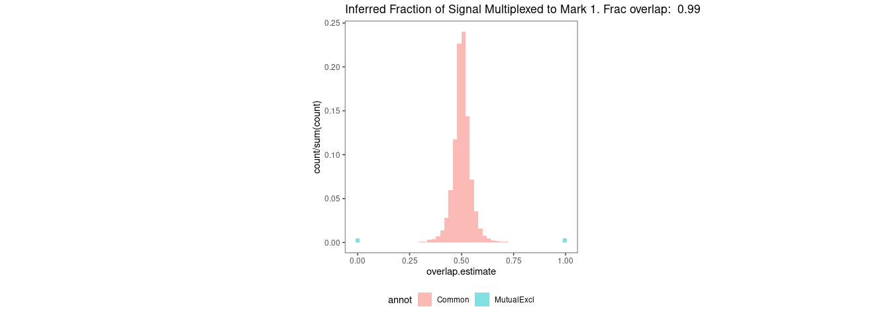

    #> 
    #> $`0.5`

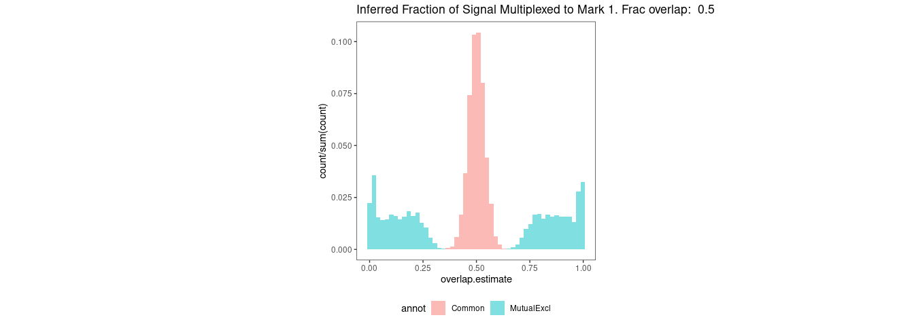

    #> 
    #> $`0.99`

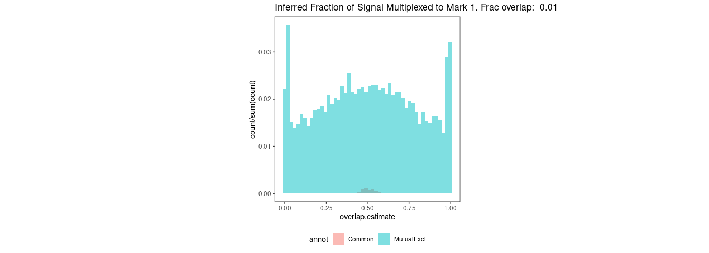

``` r
JFuncs::multiplot(m.infer.lst[[1]], m.infer.lst[[2]], m.infer.lst[[3]], cols = 3)
```

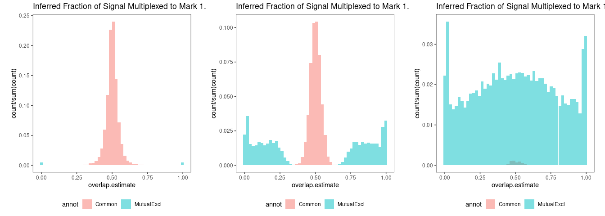
