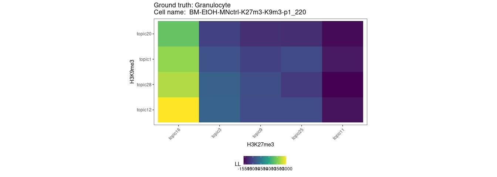
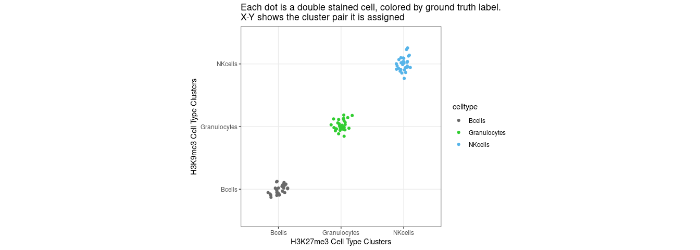
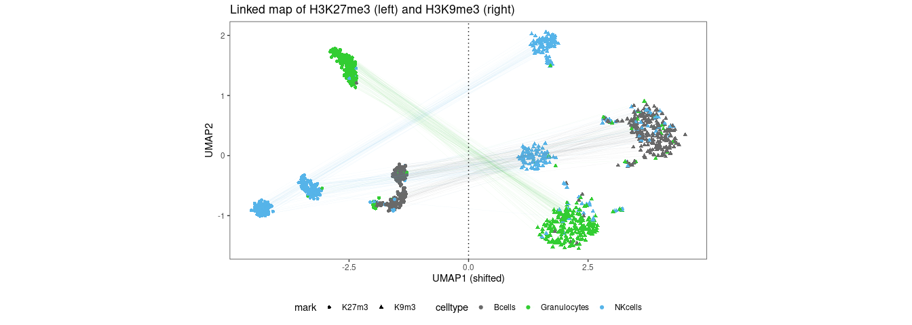

Model selection to infer cluster-pair for each double-incubated cells
---------------------------------------------------------------------

First we load the two pre-trained multinomial models (one for each mark)
inferred from the single-incubated data.

The model is a probability of getting a read within a region relative to
other regions.

This can be estimated from as simple as just fraction of reads in bin /
total reads for each cluster.

Here we ran Latent Dirichlet Allocation (Package: `topicmodels`) to
estimate this bin-specific probability genome-wide.

Now for every double-incubated cell (here we take a subset of 90 cells
for speed), we perform model selection. The fitting infers which
cluster-pair (one from H3K27me3, one from H3K9me3) best fits the
observed double-incubated cut for each cell.

    #>    user  system elapsed 
    #>  64.490   0.511  65.130

We plot the fit for one cell as an example of the output. Here we show a
double-incubated granulocyte cell (which we know from ground truth from
FACS) is correctly predicted to come from a mixture of
granulocyte-specific H3K27me3 distribution plus a granulocyte-specific
H3K9me3 distribution.

    #> [1] "BM-EtOH-MNctrl-K27m3-K9m3-p1_220"
    #> [1] "Granulocytes"

For each double-incubated cell, we select the best cluster-pair inferred
from the model and summarize the assignments in a 2D grid.

    #> Joining, by = "cell"

Unmixing cut fragments in double-incubated cells to respective histone modification
-----------------------------------------------------------------------------------

For each double-incubated cell, we now have a model of how H3K27me3 and
H3K9me3 are mixed together to generate the observed double-incubated cut
fragments. We use this cell-specific model to assign reads in each
regions to either H3K27me3 or H3K9me3.

    #> [1] TRUE
    #>    user  system elapsed 
    #>   0.059   0.004   0.063

Projecting unmixed cells
------------------------

We take the H3K27me3 cuts deconvolved from double-incubated cells and
project them onto the H3K27me3 manifold previously learned from
single-incubated data. And similarly we project H3K9me3 cuts onto the
H3K9me3 manifold. We project using the Latent Dirichet Allocation
framework, which takes a vector of discrete counts and infers the
cell-to-topic weights (which tells you where the new cells will be
located in the UMAP), while freezing the topic-to-region weights (which
have already been learned from the single-incubated data).

We project only 10 cells onto the manifold to show how its done without
having to wait too long to finish while still running on a single core.

    #> [1] "Projecting to a few unmixed cells to K27me3 manifold"
    #>    user  system elapsed 
    #>  48.784   0.076  49.011
    #> [1] "Projecting to a few unmixed cells to K9me3 manifold"
    #>    user  system elapsed 
    #>  66.143   0.004  66.170

Linking UMAPs from distinct histone modifications together
----------------------------------------------------------

We can visualize both UMAPs together now. We link the two UMAPs together
with the deconvoved double-incubated cells as connections between the
two UMAPs.

    #> Joining, by = "cell"
    #> Joining, by = "cell"

